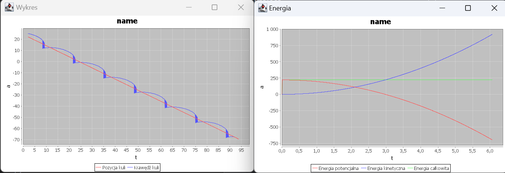

# 🎢 Inclined Ball Rolling Simulation
This project simulates a rolling ball on an inclined plane, taking into account rotational dynamics, gravitational acceleration, and energy conservation. The motion is visualized using JFreeChart, displaying both the position of the ball and its energy components over time. This project was developed for my physics class.

# How It Works
- The ball starts from rest at a height of 20 m on a 45° inclined plane.
- It accelerates under gravity while rolling, obeying conservation of energy.
- The simulation computes position, velocity, angular velocity, and energy at each time step.

