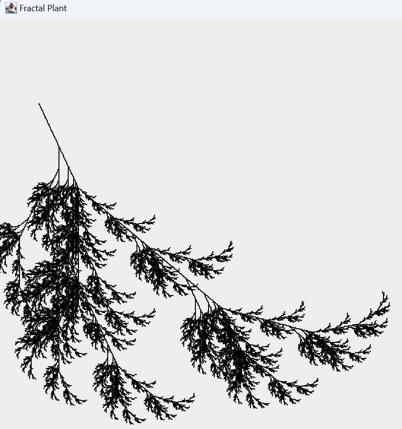

# 🌿 Fractal Plant Generator
This project generates L-System-based fractal plants using Java. The implementation follows a recursive growth pattern, simulating botanical structures.

# L-System Rules
Axiom: X (starting symbol)

Rule 1: X → F+[[X]-X]-F[-FX]+X

Rule 2: F → FF

### Symbols:
- F → Move forward
- \+ → Turn left by ANGLE
- \- → Turn right by ANGLE
- \[ → Push current state (for branching)
- \] → Pop saved state (return from branch)

# How It Works
Generates an L-System word based on the given rules and number of iterations.

Uses a Turtle Graphics system to interpret the word and draw the fractal.

Displays the generated plant in a Swing window.