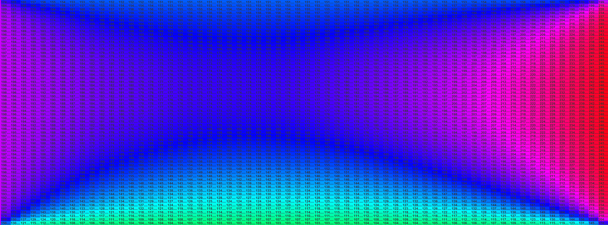

# 🔥 Heat Conduction Simulation
This project simulates steady-state heat conduction across a 2D rectangular plate using the finite difference method. The simulation calculates the temperature distribution across the grid based on user-defined boundary temperatures and visualizes the results in a heatmap. I created this project for my physics classes.

# How It Works
- The user enters the grid width and height.
- The user sets four boundary temperatures (top, bottom, left, right).
- The program solves the heat equation using a finite difference method and Gaussian elimination.
- The resulting temperature distribution is displayed in a colored grid.
    - **Hotter areas** are shown in **red**.
    - **Colder areas** appear **blue**.