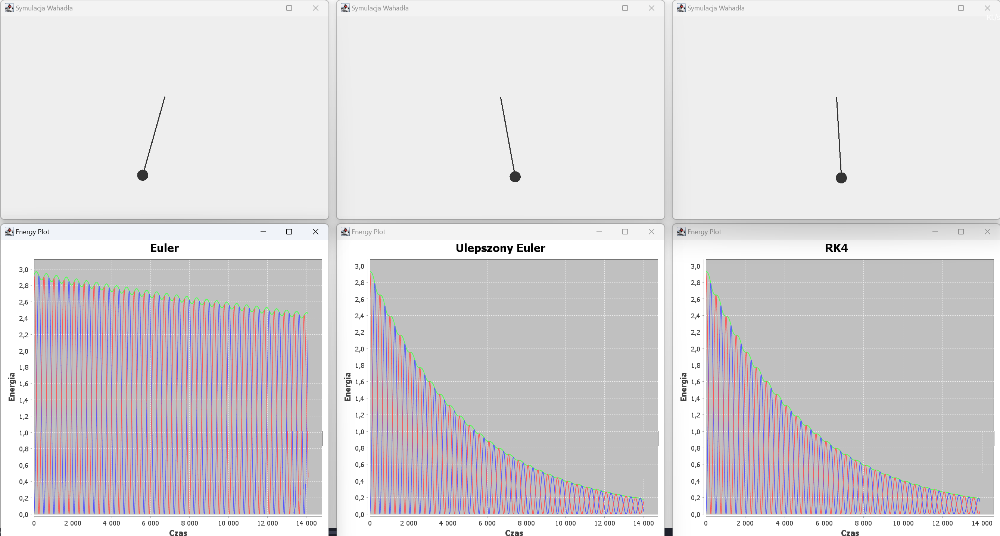

# ⏳ Pendulum Simulation
This project simulates a damped pendulum using different numerical integration methods:
- Euler's method (basic approach)
- Improved Euler's method (better accuracy)
- Runge-Kutta 4th order (RK4) (high precision)

The simulation tracks potential energy, kinetic energy, total energy and plots them in real time.

#  How It Works
The program opens three simulation windows, each showing a pendulum using a different integration method.

Each pendulum starts from an initial angle and swings under the influence of gravity.

Energy graphs update in real time, showing how potential and kinetic energy evolve.

The damping factor slows down the motion over time.

