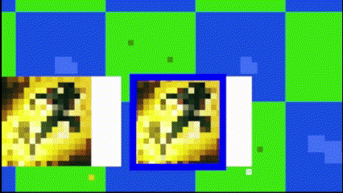

# 🎮 Ferie23
Ferie23 is a project I created while learning Java to better understand its capabilities. To achieve this, I avoided using ready-made libraries and instead focused on developing a 2D game using various aspects of Java from scratch.
# Controls
WASD – Movement

Right Mouse Button (RMB) – Use selected ability (Dash)

Scroll Wheel – Switch between abilities

Arrow Up/Down – Zoom in/out

# Key features
- Dynamic Rendering – Only the visible part of the map is rendered to optimize performance.
- Animated Environment & Abilities – Smooth animations for abilities and map elements.
- Dash Ability – Includes particle effects, ability selection, and cooldown management.

Environmental Animations:

Dash Ability with Particles, Ability Selection, and Cooldown:

