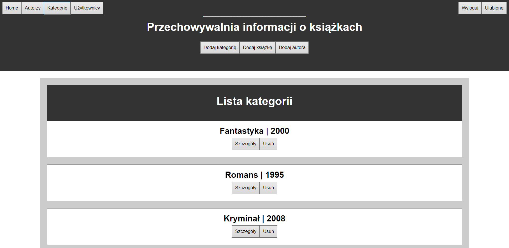

# 📖 Library database
This is a project i created for my uni class. It is a web-based application designed for book management. It consists of a **frontend** built with Angular and a **backend** powered by Node.js and MySQL.


## Features

- User authentication and registration (admin & regular users)
- Browse, add, edit, and delete books, authors, and categories
- Pagination for book listings
- Secure JWT authentication for protected routes
- Fully responsive UI built with Angular

## Installation & Setup
### **1. Database Setup**
The MySQL database should be created and initialized using the provided `tin1.sql` script. 

server config: (port 3306, 'localhost', user: 'root', password: '1234', database schema: 'main'-> CREATE SCHEMA `main`;)

### **2. Backend Setup**
Navigate to the back folder and install dependencies:
```sh
npm install
```
Start the server:
```sh
node server.js
```
The backend will start on http://localhost:3000

### **3. Frontend Setup**
Navigate to the front folder and install dependencies:
```sh
npm install
```
Run the frontend application:
```sh
ng serve -o
```
The frontend will be available on http://localhost:4200
### **API Endpoints**

|Method | Endpoint          | Description                       | Authorization |
|-------|-------------------|-----------------------------------|-------|
|GET	|/api/books         | Get a paginated list of books     | Public|
|GET	|/api/bookID/:id    | Get details of a book             | Public|
|GET	|/api/autors        | Get a paginated list of authors   | Public|
|GET	|/api/categories    | Get all categories                | Public|
|POST	|/api/addBook       | Add a new book                    | Admin |
|PUT	|/api/bookID/:id    | Update book details               | Admin |
|DELETE	|/api/deleteBook/:id| Delete a book                     | Admin |

###  **Credentials for Testing**

#### Regular User

- Login: user
- Password: user123

#### Admin User
- Login: admin
- Password: pass
