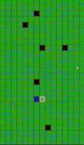

# 🐍 Snake Game
This project is a classic Snake game implemented in Java with Swing and JTable for visualization. The game features real-time movement, event listeners, and dynamic food spawning.

# Features
- Smooth movement using event listeners and a game loop
- Food spawning
- Collision detection (wall, self, food)
- Resizable board with adaptive cell sizes
- Live score tracking

# Controls
- Arrow Keys (↑ ↓ ← →) – Move the snake
- Escape (ESC) – Exit the game
# Tech Stack
- Java (Swing, JTable) – UI rendering and game logic
- Multithreading – Ensures smooth gameplay
- Event Listeners – Handles key presses and game events
